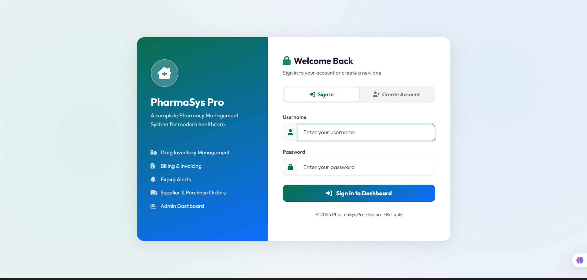
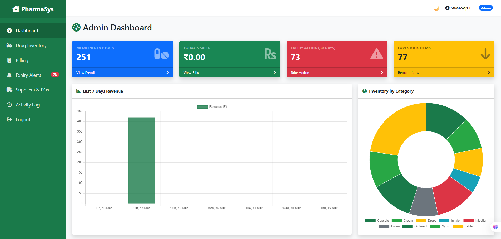
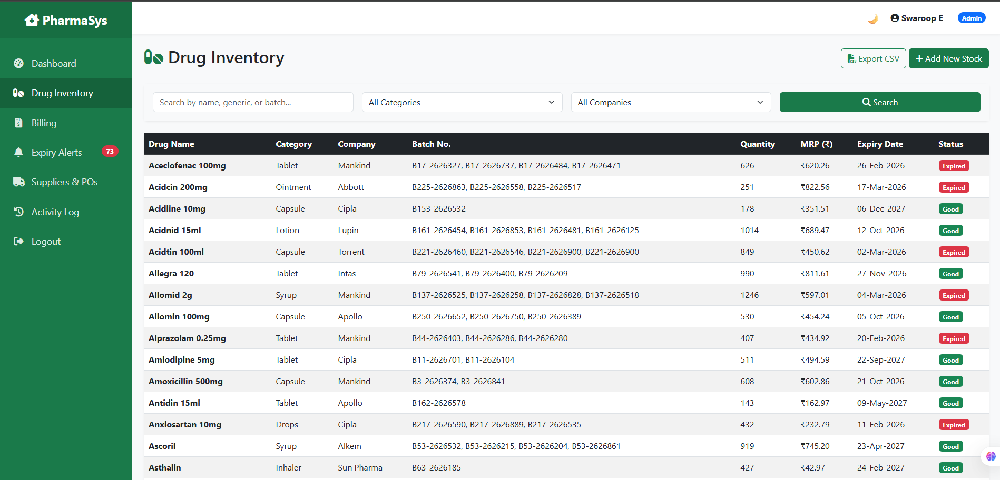
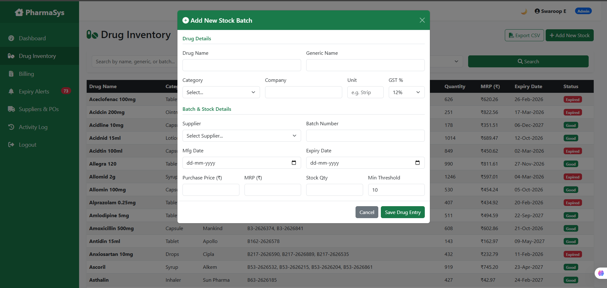
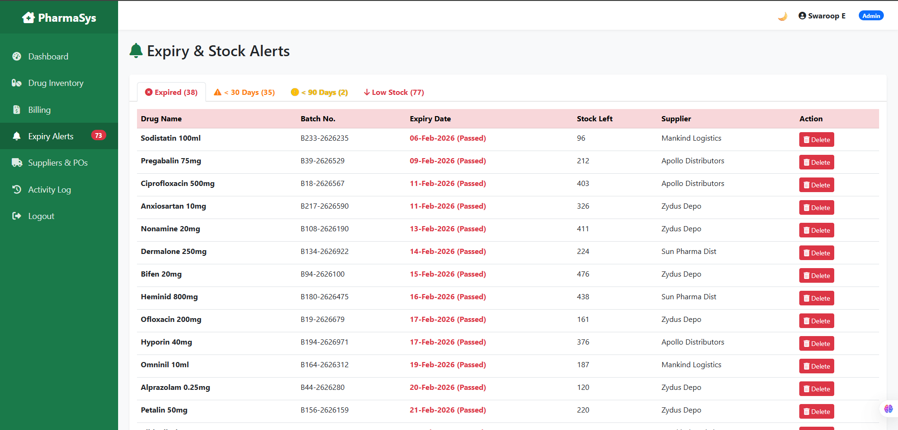
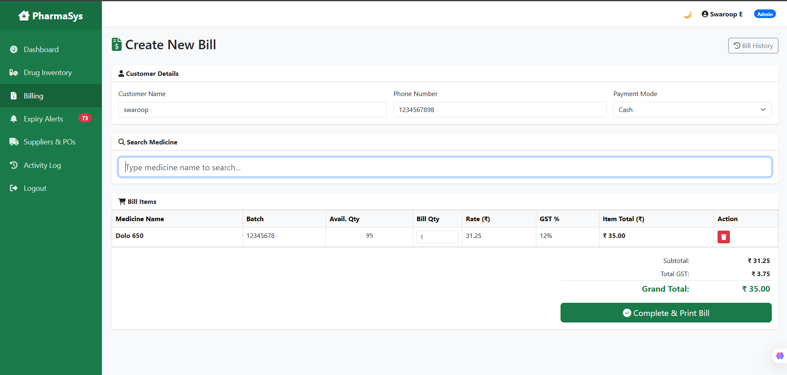
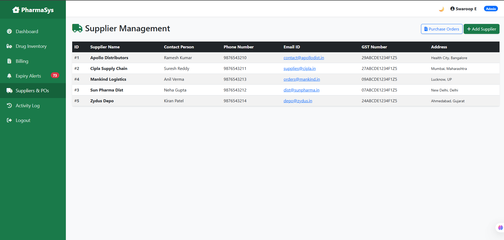

# 💊 PharmaSys — Pharmacy & Drug Inventory Management System

A full-stack web application built with **Flask** for managing a pharmacy's drug inventory, billing, suppliers, expiry alerts, and user access control.

---

## 📸 Screenshots

### 🔐 Login Page


### 📊 Admin Dashboard


### 💊 Drug Inventory List


### ➕ Add Drug (Modal Form)


### 🔔 Expiry Alerts Page


### 🧾 Billing / Create Bill


### 🚚 Suppliers & Purchase Orders


---

## 📌 Project Description

**PharmaSys** is a complete pharmacy inventory management system designed for small to medium-sized pharmacies. It allows admins and pharmacists to:

- Track drug stock with batch-level detail
- Get automatic alerts for expiring or low-stock drugs
- Generate and manage billing/invoices
- Manage suppliers and purchase orders
- Monitor activity logs (Admin only)
- Switch between Light and Dark mode

---

## ✅ Key Features

| Feature | Description |
|---|---|
| 🔐 Authentication | Login, Register with role-based access (Admin / Pharmacist) |
| 💊 Drug Inventory | Add, search, filter, paginate, and export drugs as CSV |
| 🔔 Expiry Alerts | Auto-categorized: Expired / Critical (≤30 days) / Warning (≤90 days) |
| 📦 Low Stock Alerts | Flags drugs below minimum threshold |
| 🧾 Billing | Create bills, apply GST, generate PDF invoice, view history |
| 🚚 Suppliers | Add/manage suppliers, create Purchase Orders |
| 📊 Admin Dashboard | Overview cards + activity log |
| 🌙 Dark Mode | Toggle persisted via `localStorage` |

---

## 🛠️ Technologies Used

### Backend
| Technology | Purpose |
|---|---|
| **Python 3.x** | Core programming language |
| **Flask 3.0** | Web framework |
| **SQLite** | Lightweight database |
| **Werkzeug** | Password hashing & security |
| **ReportLab** | PDF invoice generation |
| **Jinja2** | HTML templating engine |

### Frontend
| Technology | Purpose |
|---|---|
| **HTML5** | Page structure with semantic tags |
| **Bootstrap 5.3** | UI components & responsive layout |
| **Font Awesome 6** | Icons throughout the UI |
| **Vanilla JavaScript** | Dark mode toggle, flash message auto-dismiss |
| **Custom CSS** | Sidebar layout, dark mode styles |

---

## 📁 Project Structure

```
PharmacySystem/
│
├── app.py                  # Flask application factory, DB init, context processor
├── config.py               # App configuration (SECRET_KEY, DATABASE_PATH)
├── requirements.txt        # Python dependencies
├── pharmacy.db             # SQLite database file
│
├── blueprints/             # Modular Flask Blueprints (route handlers)
│   ├── auth.py             # Login, Logout, Register
│   ├── inventory.py        # Drug list, Add drug, Export CSV, Alerts
│   ├── billing.py          # Create bill, PDF, Bill history
│   ├── suppliers.py        # Supplier CRUD, Purchase Orders
│   └── admin.py            # Dashboard, Activity Logs
│
├── database/
│   └── schema.sql          # Database schema (tables definition)
│
├── static/
│   ├── css/style.css       # Custom styles + dark mode
│   └── js/script.js        # Dark mode toggle, alert auto-dismiss
│
└── templates/
    ├── base.html           # Base layout (sidebar, navbar, flash messages)
    ├── auth/login.html     # Login & Register page
    ├── inventory/list.html # Drug inventory table + modals
    ├── billing/create.html # Billing form
    ├── billing/history.html
    ├── suppliers/          # Supplier pages
    ├── alerts/list.html    # Expiry & low stock alerts
    └── admin/              # Dashboard & logs
```

---

## ⚙️ Setup Instructions

### 1. Prerequisites
Make sure you have the following installed:
- Python 3.9 or higher → [Download](https://www.python.org/downloads/)
- pip (comes with Python)

---

### 2. Clone or Download the Project

```bash
git clone https://github.com/your-username/PharmacySystem.git
cd PharmacySystem
```

Or download the ZIP and extract it.

---

### 3. Create a Virtual Environment

```bash
# Windows
python -m venv venv
venv\Scripts\activate

# Mac / Linux
python3 -m venv venv
source venv/bin/activate
```

---

### 4. Install Dependencies

```bash
pip install -r requirements.txt
```

---

### 5. Run the Application

```bash
python app.py
```

The app will automatically create the SQLite database (`pharmacy.db`) on first run.

Open your browser and go to:
```
http://127.0.0.1:5000
```

---

### 6. Default Login Credentials

> ⚠️ Change these immediately after first login!

| Role | Username | Password |
|---|---|---|
| Admin | `admin` | `admin123` |
| Pharmacist | `pharma` | `pharma123` |

*(These can be created via the Register form on the login page)*

---

## 📦 Requirements

```
Flask==3.0.0
Werkzeug==3.0.1
reportlab==4.0.8
```

Install with:
```bash
pip install -r requirements.txt
```

---

## 🚀 Deployment (Render.com)

1. Push your project to GitHub
2. Go to [Render.com](https://render.com) → **New Web Service**
3. Connect your GitHub repo
4. Set:
   - **Build Command:** `pip install -r requirements.txt`
   - **Start Command:** `python app.py`
5. Add Environment Variable:
   - `SECRET_KEY` → any long random string
6. Click **Deploy** ✅

---

## 👨‍💻 Author

**E.V.B.J. Swaroop**
Full Stack Developer | Python & Flask Enthusiast

---

## 📄 License

This project is for educational purposes.
